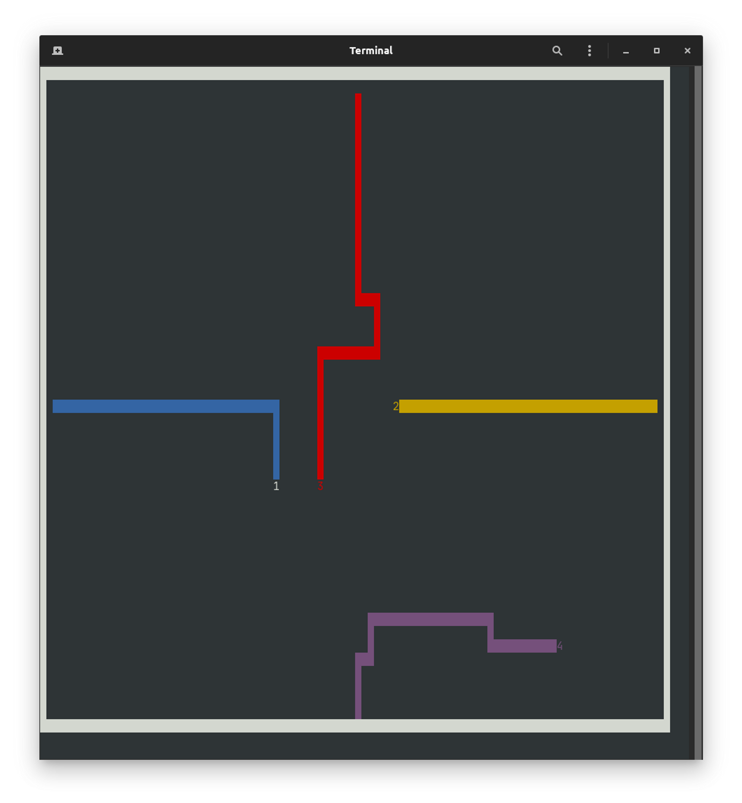

# Projet C-tron



Il y a deux versions du projet. Une respectant les consignes de base, et une autre avec quelques améliorations que nous avons apportées.

Le dossier `include` de chaque version regroupe les fichiers d'entête contenant les structures de données et les prototypes de fonctions avec des commentaires qui expliquent leur fonctionnement de manière globale. Le dossier `src` contient tout simplement le code source du projet.

## Version de base

- Build le projet

```
cd version-de-base ; make
```

- Lancer le programme du serveur

```
./server [port_serveur] [refresh_rate]
```

- Lancer le programme du client

```
./client [IP_serveur] [port_serveur] [nb_joueurs]
```

## Version améliorée

- Build le projet

```
cd version-ameliore ; make
```

- Lancer le programme du serveur

```
./server [port_serveur] [refresh_rate] [max_joueurs]
```

- Lancer le programme du client

```
./client [IP_serveur] [port_serveur] [nb_joueurs]
```
